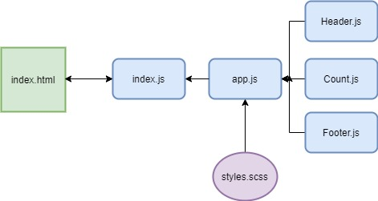

# LAB - Class 22

## reactTestDeploy - React Testing and Deployment

### Author: Madison Stehle

### Links and Resources

- [submission PR](https://github.com/madisonstehle/reactTestDeploy/pull/1)
- [ci/cd github actions]()
- [netlify](https://elastic-yalow-2f773f.netlify.app/)
- [aws s3](http://react-test-deploy-401n16.s3-website-us-west-2.amazonaws.com/)
- [aws amplify](https://master.d3rgknq439yezj.amplifyapp.com/)

### Setup

#### How to initialize/run the application

- `npm start` if running locally

#### Tests

- `npm test` will run tests for App and Counter

#### UML

